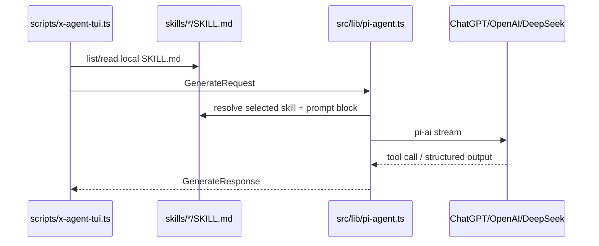
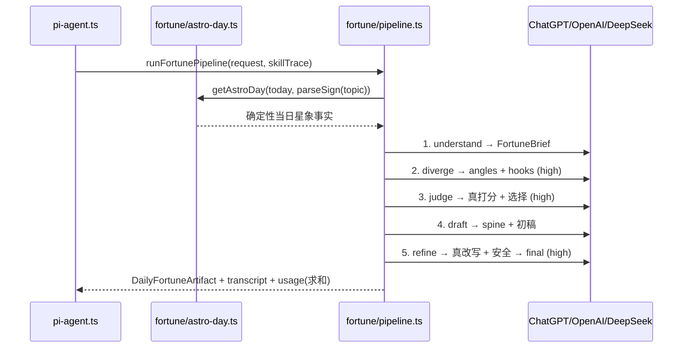

# 数据流程

## Generate



> 注意：当选中的 skill 是 `daily-fortune-tweet` 时，`pi-agent` 不走上面的单次 `finalize_twitter_creative` 路径，而是路由到 5 段推理 pipeline（见下）。其余 skill 仍走单次路径。

## Daily Fortune Pipeline

`daily-fortune-tweet` 由 `src/lib/fortune/pipeline.ts` 编排为 5 段**独立**模型推理，每段独立 context、独立 system prompt、独立结构化输出 schema（typebox），复用 `src/lib/pi-model.ts` 的 `resolveModel` / `streamForModel` / `getModelApiKey`。



- **astro-day**（确定性，无模型）：`parseSign` 解析星座；`getAstroDay(date, sign)` 给出 `weekday/weekdayPlanet`、`moonPhase`、`sunSeason`、`signProfile`、`focusDomain`（按 `date+sign` 确定性轮换）、`emotionalWeather`、`dailySeed`。同 `(date, sign)` 永远同结果，解决"每日同质化"。
- 角度判分与改写由独立的 judge / refine 段真实执行（不再由写稿者自评）。
- 完整 `DailyFortuneArtifact` 在 pipeline 的**代码侧**确定性组装；usage 为各段求和。
- 长度兜底：`longTweet`/`both` 若 final 正文 < 600 中文字，确定性触发第 6 段 `expand` 扩写到 600-1200 字（仅在更长时采用）。可用 `FORTUNE_THINKING_CAP=low|medium|high` 统一封顶各段 thinking 以加速 eval。
- 失败处理：任一段以 `stopReason: error/aborted` 结束时抛 `模型调用失败（<stage>）：…`（`pi-agent` 直接上抛）；非模型异常降级到保底 artifact。

## GenerateRequest

核心字段：

- `topic`
- `audience`
- `goal`
- `tone`
- `constraints`
- `skillIds`
- `outputType`

MVP 不包含 `includeImage`。

## TwitterCreative

当前文本 artifact：

- `tweet`
- `hashtags`
- `rationale`
- `safetyNotes`
- `dailyFortune?`（运营级 Daily Fortune artifact）

保留扩展：

- `media?: CreativeMediaExtension`

`media` 只作为未来图片/媒体扩展槽，当前 TUI 不展示、不生成。

## Local Skills

本地 skill 数据来自：

```text
skills/<slug>/SKILL.md
```

`src/lib/skills/local-skills.ts` 读取并解析：

- frontmatter `name`
- frontmatter `description`
- frontmatter `metadata.version`
- frontmatter `allowed-tools`
- Markdown body
- validation result
- `references/*.md` 内容（按文件名排序、always loaded）
- `evals/*.json` 质量门规则（由 `scripts/eval-skills.ts` 校验）

skill 不写入任何数据库，只读本地 `skills/<slug>/SKILL.md`。

Daily Fortune references 位于：

```text
skills/daily-fortune-tweet/references/*.md
skills/daily-fortune-tweet/evals/*.json
```

runtime 会把 references 内容注入 skill-aware prompt，并在 `RunSkillTrace.loadedReferences` 和 `GenerateResponse.references` 暴露引用来源。

## DailyFortune

Daily Fortune artifact 当前结构包含：

- `inputSummary`
- `audienceInsight`
- `angleOptions`
- `selectedAngle`
- `hookOptions`
- `fortuneSpine`
- `draftV1`
- `operatorCritique`
- `final.longTweet`
- `final.thread`
- `engagementPlan`
- `reviewNotes`

强约束细节：

- `angleOptions[]` 包含 `angle`、`thesis`、`emotionalHook`、`concreteScene`、`whyItWorks`、`safetyRisk`。
- `hookOptions[]` 包含 `type`、`text`、`whyItWorks`，type 限定为 `contrarian | scene | confession | mystical-image | practical-warning`。
- `fortuneSpine` 包含 `audienceSpecificScene`、`tinyRitual`、`closingImage`。

TUI 渲染规则：

- `outputType=longTweet`：主体展示 `final.longTweet.body`，顶层 `tweet` 只是短摘要。
- `outputType=thread`：主体展示 `final.thread`，逐条展示，并额外打印 `full thread copy`。
- `outputType=both`：同时展示 long post 和 thread。

## TUI Session

TUI session 数据只保存在当前进程内：

- selected provider / model（通过 `/model <provider> [model]` 切换时写入当前进程 `process.env`）
- selected skill
- tone
- output type
- audience
- goal
- constraints
- generated artifact history

退出 TUI 后，生成 artifact history 不落地保存。TUI 输入历史会落地到 `.x-agent-tui-history`（或 `X_AGENT_TUI_HISTORY_FILE` 指定路径），用于下次进入 TUI 时方向键检索历史输入。

## Model Credentials

TUI 启动时通过 `process.loadEnvFile` 加载仓库根目录 `.env`，凭据进入 `process.env`。读取优先级（`src/lib/pi-credentials.ts`）：

1. provider=`openai-codex`：`OPENAI_CODEX_ACCESS_TOKEN` → `OPENAI_CODEX_OAUTH_CREDENTIALS`（pi-ai 自动刷新 access token）。
2. provider=`deepseek`：`DEEPSEEK_API_KEY`，通过 pi-ai `openai-completions` 调用 OpenAI-compatible Chat Completions，默认 `DEEPSEEK_BASE_URL=https://api.deepseek.com`、`PI_MODEL=deepseek-v4-pro`。
3. provider=`openai`（或未设 `PI_PROVIDER`）：`OPENAI_API_KEY`。

`OPENAI_CODEX_OAUTH_CREDENTIALS` 必须是**单行 JSON**（多行会被 dotenv 截断成 `{`）。凭据轮转时 `pi-credentials` 会通过 logger 提示更新 `.env`。TUI 不依赖任何登录 session。

## 错误与保底

- 模型硬错误（凭据无效、传输失败、aborted）以 `stopReason: "error"/"aborted"` 返回，`pi-agent` 抛出真实原因，TUI 显示 `模型调用失败：<reason>`，不再用保底模板掩盖。
- `maxTokens` 默认 8192，可用 `PI_MAX_TOKENS` 覆盖（reasoning 与长文本 artifact 共用预算）。
