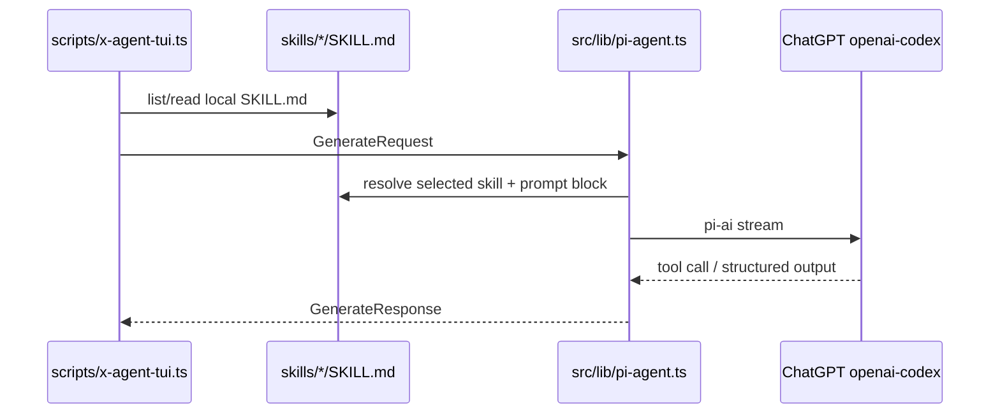

# 数据流程

## Generate



## GenerateRequest

核心字段：

- `topic`
- `audience`
- `goal`
- `tone`
- `constraints`
- `skillIds`
- `outputType`

MVP 不包含 `includeImage`。

## TwitterCreative

当前文本 artifact：

- `tweet`
- `hashtags`
- `rationale`
- `safetyNotes`
- `dailyFortune?`

保留扩展：

- `media?: CreativeMediaExtension`

`media` 只作为未来图片/媒体扩展槽，当前 TUI 不展示、不生成。

## Local Skills

本地 skill 数据来自：

```text
skills/<slug>/SKILL.md
```

`src/lib/skills/local-skills.ts` 读取并解析：

- frontmatter `name`
- frontmatter `description`
- frontmatter `metadata.version`
- frontmatter `allowed-tools`
- Markdown body
- validation result

skill 不写入任何数据库，只读本地 `skills/<slug>/SKILL.md`。

## TUI Session

TUI session 数据只保存在当前进程内：

- selected skill
- tone
- output type
- audience
- goal
- constraints
- generated artifact history

退出 TUI 后不落地保存。

## Model Credentials

TUI 启动时通过 `process.loadEnvFile` 加载仓库根目录 `.env`，凭据进入 `process.env`。读取优先级（`src/lib/pi-credentials.ts`）：

1. provider=`openai-codex`：`OPENAI_CODEX_ACCESS_TOKEN` → `OPENAI_CODEX_OAUTH_CREDENTIALS`（pi-ai 自动刷新 access token）。
2. provider=`openai`（或未设 `PI_PROVIDER`）：`OPENAI_API_KEY`。

`OPENAI_CODEX_OAUTH_CREDENTIALS` 必须是**单行 JSON**（多行会被 dotenv 截断成 `{`）。凭据轮转时 `pi-credentials` 会通过 logger 提示更新 `.env`。TUI 不依赖任何登录 session。

## 错误与保底

- 模型硬错误（凭据无效、传输失败、aborted）以 `stopReason: "error"/"aborted"` 返回，`pi-agent` 抛出真实原因，TUI 显示 `模型调用失败：<reason>`，不再用保底模板掩盖。
- `maxTokens` 默认 8192，可用 `PI_MAX_TOKENS` 覆盖（reasoning 与长文本 artifact 共用预算）。
