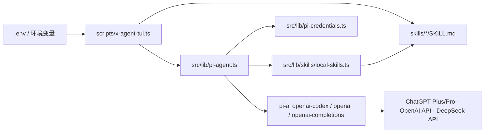

# 架构文档

## 总览

x-agent 是本地 CLI/TUI client。Operator 在终端输入自然语言请求，TUI 直接调用 `src/lib/pi-agent.ts`，通过 `@earendil-works/pi-agent-core` 和 `@earendil-works/pi-ai` 生成 X/Twitter 文本 artifact。没有 Web 服务、数据库或部署后端。



## 运行时

- 唯一 operator surface：Node CLI/TUI，`scripts/x-agent-tui.ts`（`npm run tui`）。
- 启动时加载 `.env`（`process.loadEnvFile`），让 `PI_*` / `OPENAI_CODEX_*` 凭据进入进程。
- Skill source of truth：本地 `skills/<slug>/SKILL.md`。
- Model：pi-ai `openai-codex`（默认）、`openai` 或 `deepseek`；凭据来自 `OPENAI_CODEX_OAUTH_CREDENTIALS` / `OPENAI_CODEX_ACCESS_TOKEN`、`OPENAI_API_KEY` 或 `DEEPSEEK_API_KEY`。
- 已移除：Next.js API、D1、Durable Object、OpenNext / Cloudflare 部署、Web 登录与 RBAC（保留在 git 历史中）。

## 关键模块

- `scripts/x-agent-tui.ts`：主 CLI/TUI 入口，一个输入框 + slash commands，启动时加载 `.env`。
- `skills/*/SKILL.md`：本地 skill source of truth。
- `src/lib/skills/local-skills.ts`：本地 skill loader、references loader、自动选择、prompt compiler。
- `src/lib/skills/parse-skill.ts`、`validate-skill.ts`：SKILL.md frontmatter 解析与校验。
- `src/lib/pi-agent.ts`:文本创意 agent —— system prompt、tool schema、模型调用、错误暴露、保底恢复;`daily-fortune-tweet` 路由到 fortune pipeline。
- `src/lib/pi-model.ts`:共享的模型解析/流式/凭据(`resolveModel`/`streamForModel`/`getModelApiKey`/`readMaxTokens`),供单次路径与 fortune pipeline 复用(避免循环依赖)。
- `src/lib/fortune/astro-day.ts`:确定性星象引擎 —— `parseSign`、`getAstroDay`(月相/星期主行星/太阳季/星座画像/今日侧重域/seed),纯函数、可单测。
- `src/lib/fortune/pipeline.ts`:`daily-fortune-tweet` 的 5 段推理 pipeline(understand→diverge→judge→draft→refine) + 代码侧组装 `DailyFortuneArtifact`。
- `src/lib/pi-credentials.ts`：模型凭据选择（ChatGPT OAuth / OpenAI API key / DeepSeek API key）、pi-ai OAuth refresh、凭据轮转告警。
- `src/lib/pi-oauth-runtime.ts`：import pi-ai provider 时临时屏蔽 `process.versions.node`（引用计数，可重入）。
- `src/lib/types.ts`、`validation.ts`、`logger.ts`：类型、输入校验、结构化日志。

## TUI 架构

TUI 只保留一个输入框：

- 普通文本：直接生成 X/Twitter artifact。
- `/skills`：列出本地 Markdown skills（标注 valid/invalid）。
- `/skill auto|<slug>`：切换自动选择或指定 skill（拒绝选择 invalid skill）。
- `/tone`、`/output`、`/audience`、`/goal`、`/constraints`：调整生成上下文。
- `/model`、`/config`：查看模型 provider、ChatGPT/OpenAI/DeepSeek 凭据提示和当前请求上下文。
- `/history`、`/last`：查看当前 TUI 进程内生成结果。
- 输入历史：readline 历史跨 TUI 会话持久化到 `.x-agent-tui-history`（gitignored），只保存用户输入行，不保存模型输出。

TUI 不访问任何网络后端，不登录，不落地存储。

## Agent 架构

MVP agent 只生成文本 artifact：`tweet`、`hashtags`、`rationale`、`safetyNotes`、`dailyFortune?`。`dailyFortune` 是运营级内容流水线 artifact，包含 audience insight、angle options、hook options、operator critique、engagement plan 和 `final.longTweet` / `final.thread`。`TwitterCreative.media` 是保留扩展位，不在 TUI 暴露。

生成流程：

1. `resolveRuntimeSkill` 选择本地 skill（手动 > fortune 关键词自动 > 默认）。
   - 若选中 `daily-fortune-tweet`，改走 `runFortunePipeline`（`src/lib/fortune/pipeline.ts`，5 段独立推理 + 注入确定性当日星象事实，详见 `docs/数据流程.md`）；下面 2-6 是其余 skill 的单次路径。
2. 加载完整 `SKILL.md` 和 `skills/<slug>/references/*.md`，编译进 skill-aware prompt。
3. 通过 pi agent loop 调用模型，要求以 `finalize_twitter_creative` 工具收尾。
4. 模型硬错误（`stopReason` 为 `error`/`aborted`）直接抛出真实原因，不再用保底模板掩盖。
5. 模型返回文本但未调用工具时，从 transcript 恢复；都失败才用保底 artifact。
6. 返回 `skillTrace` 仅用于 TUI 展示。

模型 `maxTokens` 默认 8192，可用 `PI_MAX_TOKENS` 覆盖（reasoning 与长文本 artifact 共用该预算）。

## Local Skill 架构

Skill 的 source of truth 是本地 Markdown：

```text
skills/
  twitter-launch-creative/
    SKILL.md
  daily-fortune-tweet/
    SKILL.md
    references/
      *.md
    evals/
      *.json
```

无效（validation errors）的 SKILL.md 不会被自动选择，也不会注入 prompt。References 会按文件名排序并以 `always` 策略加载到 prompt；`RunSkillTrace.loadedReferences` 会列出实际加载的 SKILL.md 和 references。`daily-fortune-tweet` 的 references 既有文案/运营/安全资料，也包含命理底料（星座 `astrology-signs.md`、`astrology-daily-engine.md`；东方象征 `eastern-symbolic-calendar.md`；Seth 意识内核 `seth-consciousness-framework.md`；正文边界 `public-post-boundary.md`、`playful-fortune-voice.md`）。

质量门分三层：① `npm run eval:skills`（`scripts/eval-skills.ts`）只校验 eval spec 的形状（无凭据，进 CI）；② `npm run eval:fortune:mock` 用确定性 fixture **离线**跑通整条 eval harness + 规则（无凭据，进 CI）；③ `npm run eval:fortune`（`scripts/eval-fortune-run.ts`）**真跑** fortune pipeline + 规则 + 独立 LLM-judge 评真实输出、打印运营达标率（需模型凭据，本地手动门）。
